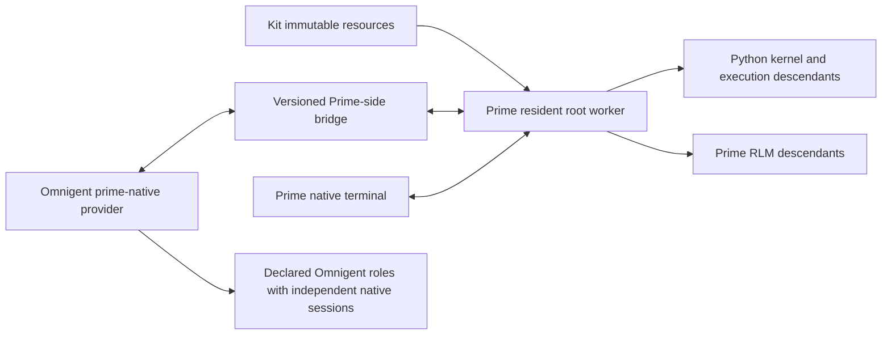

# Prime-native architecture

## Scope and status

The accepted scope is a first-class `prime-native` agent in Omnigent with full Kit integration.
Native support includes the provider, terminal, session lifecycle, tool policy, model selection, and declared-agent composition.
It also includes Prime's kernel, recursive agents, goals, schedules, gates, refinement, and extensions.

Prior static design review informed this proposal.
No Prime login, worker launch, live model call, sandbox qualification, or end-to-end integration has run.
Source contracts support the architecture. They do not establish runtime compatibility.

## Reviewed source revisions

| Repository | Reviewed revision |
| --- | --- |
| [Omnigent upstream](https://github.com/omnigent-ai/omnigent) | `7752eef36d1c2a1148a42dd3afccc16c3b08bcbd` |
| [Prime Agent upstream](https://github.com/PrimeIntellect-ai/prime-agent) | `2d24ad4e6b2d1ee8e6919af6f108e980a14d550e` |
| [Agent Profile Kit](https://github.com/mdsmithaustin/Agent-Profile-Kit) | `c8cdf6c2180acf47a79c64730a7ca3c686b114aa` |

Installed Omnigent 0.15.0 provided an additional local comparison.
The upstream revision is the implementation baseline for this fork.
These source pins are research references, not qualified production versions.

## Why a native contribution is required

Omnigent represents native coding agents with `NativeCodingAgent` and `NativeHarnessProvider`.
The provider includes native launch, terminal creation, environment, materialization, interrupt, stop, and bridge hooks.
Claude and Codex use this native path.
The generic ACP path does not establish that same native lifecycle.

The community loader rejects contributions with `native_harnesses` or `native_agents` at the reviewed revision.
The initial delivery therefore adds a core Prime native contribution in this maintained fork.
A supported external native plugin contract can replace that packaging after upstream supports it.
Generalizing the entire plugin system is not a prerequisite for the first Prime contribution.

The proposed public identities are:

| Concept | Proposed identity |
| --- | --- |
| Harness | `prime-native` |
| Native UI agent | `prime-native-ui` |
| Display name | `Prime Agent` |
| Independent Kit target | `prime` |

The independent Kit target remains optional.
Existing Kit installations retain Hermes and Omnigent as their selected targets during migration.
The `prime-native` Omnigent route works as a root and as a declared child.

## Ownership boundaries

| Owner | Responsibilities |
| --- | --- |
| Prime | Resident workers, Python kernels, recursive descendants, queues, schedules, goals, learned state, models, and authentication |
| Prime-side bridge | Versioned attachment and command contract, Prime daemon adaptation, event correlation, recovery, control ownership, and policy interception |
| Omnigent native contribution | Native registration, provider hooks, terminal integration, orchestration, presentation, and declared-agent composition |
| Kit | Resource compilation, route selection, release receipts, inspection, installation lifecycle, controlled launch, and sandbox admission |

The bridge does not implement another scheduler, kernel, RLM engine, or skill loader.
Omnigent does not copy Prime mutable state into its conversation store for recovery.
Kit rollback changes managed resources. It does not roll back transcripts, kernels, authentication, schedules, or learned state.

## Bridge and session model

Prime already daemon-backs ordinary `--mode acp` by default.
Its CLI can bind an existing daemon session through local session information.
A new `acp-daemon` mode is not assumed by this design.

ACP advertises no standard session loading and assigns a connection-facing session UUID.
It also clears ACP-owned MCP configuration and aborts its prompt signal on disconnect.
Those facts require explicit attachment and lifecycle behavior in our integration.
They do not imply that Prime's resident worker or idle kernel always dies with an ACP process.

The bridge exposes a stable Prime root identity to Omnigent.
The bridge keeps raw daemon envelopes inside the Prime-side build.
It reuses Prime's ACP implementation where that implementation covers the required transport behavior.
It supplies native control and event operations that standard ACP does not cover.
The external encoding and complete operation inventory remain P1 proof work.

The binding record names the Omnigent role or conversation, Prime root, execution host, canonical workspace, resource digest, and compatible versions.
Runtime observations include worker generation and an acknowledged event cursor.
Generation is an event-history boundary, not a fixed identity requirement.
A generation change invalidates stale events and triggers an authoritative snapshot.
A cursor gap also triggers snapshot reconciliation.
Recovery reports possible loss of in-memory Python state.
Accepted or uncertain commands are not blindly replayed.

A root-scoped controller contract applies to both the Prime terminal and Omnigent.
Prime enforces interactive mutation authority, including model changes and extension-dialog responses.
Read-only viewers may attach concurrently.
Controller detachment releases the attachment without silently stopping resident work.
Explicit cancellation and root shutdown remain separate actions.
Prime's own scheduled input continues through its existing execution queue.

## Two distinct agent trees

An Omnigent declared role has its own harness choice, identity, runtime session, and policy binding.
A Prime RLM descendant belongs to its Prime parent tree and retains Prime lineage.
The presentation may expose a descendant link without creating another declared Omnigent role.

A Prime lead may invoke declared Codex and Claude roles through Omnigent.
A Codex or Claude lead may invoke a declared Prime role.
Prime may also create recursive RLM descendants inside any declared Prime role.
Those descendants do not acquire independent Kit role definitions or a second orchestration owner.

## Instructions and resource lifetime

Kit compiles one immutable resource artifact for identity additions, skills, Python dependency requirements, and MCP declarations.
The direct Prime target and the Omnigent route reference the same artifact digest.
The shared digest covers portable resources.
Target-specific launch behavior, framework composition, and declared-role dispatch remain runtime-owned.
Prime receives Kit identity through `APPEND_SYSTEM.md` or an explicit resource-loader contribution.
Prime's base system instructions remain present.

Omnigent framework instructions stay canonical in their owning framework module and composition boundary.
The native adapter transports the composed instructions.
It does not add lifecycle metadata fields to `AgentSpec` or duplicate framework policies in Prime-specific prompts.
User-authored profile identity remains separate from framework-owned behavior.

A live root keeps its resource digest and Python dependency environment.
An upgrade affects new roots until an explicit migration or restart.
Resource retention accounts for all live and resumable bindings before deletion.
Authentication, session files, kernel state, goals, schedules, and learned state use private mutable storage outside the artifact.

## Permissions and the execution boundary

An approval record is not evidence that execution was prevented or confined.
The permission decision must reach an execution gate on the Prime side.
Clients attached to the same root share the same execution policy.
A native terminal cannot bypass the policy selected for that root.

Prime's arbitrary Python kernel requires an OS execution boundary for filesystem and network confinement claims.
The actual worker, kernel, shell processes, MCP processes, RLM children, and recursive grandchildren inherit that boundary.
Putting only the ACP client in a sandbox is insufficient.
The execution host and daemon endpoint form part of the admitted binding.
A sandbox launch must not accidentally attach to a host Prime worker.

Use each repository's existing sandbox backend and bootstrap conventions.
The Kit's Docker SBX image must reproduce pinned Prime and Python dependencies.
Host home directories, unrelated sessions, and the host Docker socket remain outside the guest boundary.
Per-platform enforcement and authentication projection remain unqualified until P4 evidence exists.

## Liveness and tool availability

Omnigent generic ACP has a 300-second default inactivity deadline.
Prime may legitimately wait for children, background work, permissions, scheduled input, or a continuing goal.
The native integration uses worker health and typed execution state to distinguish those waits from a failed bridge.
It retains bounded deadlines for individual bridge requests.

Persistent work needs explicit MCP availability.
Required tools either have a root-scoped lifecycle or report a typed unavailable state after client loss.
Reconnect restores the approved catalog before dependent work resumes.
An ACP response boundary does not establish settlement of outstanding Prime descendants.
Prime's terminal-quiescence state remains authoritative.

## Maintainability and upstream strategy

One Prime native contribution owns Omnigent behavior.
One Prime-side bridge adapts the engine.
One Kit resource compiler supplies both launch paths.
Versioned capability declarations describe observed support.
An unknown bridge revision or missing required capability fails admission explicitly.

Compatibility patches name the upstream revision, expected source digest, reason, behavioral check, and retirement condition.
Patch application fails when its input does not match.
The first qualified release records a tested Omnigent, Prime, bridge, and resource-format combination.
Upgrades run the root, child, mixed-role, recovery, and sandbox matrix before changing that combination.
The current design branch opens no implementation PR and makes no runtime support claim.

## Source map for the next engineer

| Area | Source at the reviewed revision |
| --- | --- |
| Native identities and providers | [Omnigent harness registry](https://github.com/omnigent-ai/omnigent/blob/7752eef36d1c2a1148a42dd3afccc16c3b08bcbd/omnigent/harness_plugins.py#L70-L134) |
| Community native restriction | [Omnigent plugin admission](https://github.com/omnigent-ai/omnigent/blob/7752eef36d1c2a1148a42dd3afccc16c3b08bcbd/omnigent/harness_plugins.py#L1002-L1022) |
| Native provider environment dispatch | [Native orchestration](https://github.com/omnigent-ai/omnigent/blob/7752eef36d1c2a1148a42dd3afccc16c3b08bcbd/omnigent/runner/native/orchestration.py#L9146-L9218) |
| Generic ACP construction and extension hook | [ACP harness](https://github.com/omnigent-ai/omnigent/blob/7752eef36d1c2a1148a42dd3afccc16c3b08bcbd/omnigent/inner/acp_harness.py#L153-L208) |
| Generic inactivity deadline | [ACP executor](https://github.com/omnigent-ai/omnigent/blob/7752eef36d1c2a1148a42dd3afccc16c3b08bcbd/omnigent/inner/acp_executor.py#L158-L169) |
| Prime daemon-backed ACP startup | [Prime main](https://github.com/PrimeIntellect-ai/prime-agent/blob/2d24ad4e6b2d1ee8e6919af6f108e980a14d550e/packages/coding-agent/src/main.ts#L1580-L1636) |
| Prime ACP behavior and metadata | [Prime ACP documentation](https://github.com/PrimeIntellect-ai/prime-agent/blob/2d24ad4e6b2d1ee8e6919af6f108e980a14d550e/packages/coding-agent/docs/acp.md) |
| ACP disconnect cleanup | [Prime ACP implementation](https://github.com/PrimeIntellect-ai/prime-agent/blob/2d24ad4e6b2d1ee8e6919af6f108e980a14d550e/packages/coding-agent/src/modes/acp/acp-mode.ts#L1207-L1223) |
| Reconnect and command journaling | [Prime daemon documentation](https://github.com/PrimeIntellect-ai/prime-agent/blob/2d24ad4e6b2d1ee8e6919af6f108e980a14d550e/packages/coding-agent/docs/daemon.md) |
| Client and engine separation | [AgentConnection architecture](https://github.com/PrimeIntellect-ai/prime-agent/blob/2d24ad4e6b2d1ee8e6919af6f108e980a14d550e/packages/coding-agent/docs/agent-connection.md) |
| Resource loading | [Prime resource loader](https://github.com/PrimeIntellect-ai/prime-agent/blob/2d24ad4e6b2d1ee8e6919af6f108e980a14d550e/packages/coding-agent/src/core/resource-loader.ts) |
| Python skills and session requirements | [Prime skills](https://github.com/PrimeIntellect-ai/prime-agent/blob/2d24ad4e6b2d1ee8e6919af6f108e980a14d550e/packages/coding-agent/docs/skills.md) |
| Goals, schedules, and quiet work | [Prime long-running agents](https://github.com/PrimeIntellect-ai/prime-agent/blob/2d24ad4e6b2d1ee8e6919af6f108e980a14d550e/packages/coding-agent/docs/long-running-agents.md) |
| Kit root and child route validation | [Kit release compiler](https://github.com/mdsmithaustin/Agent-Profile-Kit/blob/c8cdf6c2180acf47a79c64730a7ca3c686b114aa/profile_kit/release.py#L599-L610) |
| Kit adapter and lifecycle shape | [Kit native adapter](https://github.com/mdsmithaustin/Agent-Profile-Kit/blob/c8cdf6c2180acf47a79c64730a7ca3c686b114aa/profile_kit/native.py#L102-L119) |
| Kit controlled launch | [Kit launch](https://github.com/mdsmithaustin/Agent-Profile-Kit/blob/c8cdf6c2180acf47a79c64730a7ca3c686b114aa/profile_kit/launch.py#L874-L912) |
| Kit protocol guard | [Kit native guard](https://github.com/mdsmithaustin/Agent-Profile-Kit/blob/c8cdf6c2180acf47a79c64730a7ca3c686b114aa/profile_kit/native_guard.py#L730-L762) |

## Design decisions after the attack

The headless ACP-only proposal failed the native-registration and control requirements.
The revised design uses Omnigent's native provider contract and a Prime-owned bridge.
The public integration keeps daemon types private to the Prime-side build.
Worker replacement triggers reconciliation instead of permanent resume rejection.
Declared roles and RLM descendants remain separate types.
Execution policy applies to the worker tree instead of relying on client-event parsing.

Experience First changed the target to the full native workflow.
Model the Domain changed the agent trees and route assumptions into explicit contracts.
Separate Before Serializing Shared State changed resource and mutable-state ownership.
Sequence Work into Verifiable Units puts the cross-runtime session and policy proof before broad Kit changes.
