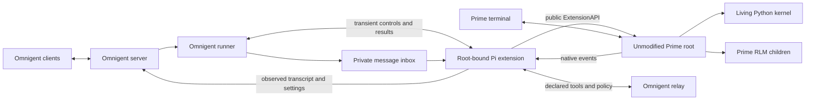

# Prime-native integration without vendor changes

This is the active design and qualification record for Omnigent's `prime-native` adapter. It supersedes the fork-dependent [architecture](DESIGN.md), [controller contract](CONTRACT.md), and [implementation sequence](IMPLEMENTATION.md). Prime remains the published, unmodified runtime. Agent Profile Kit is outside this implementation.

## Runtime ownership

Users launch `omnigent prime-native`, send messages through Prime's terminal or Omnigent, and reattach with `omnigent prime-native --resume`. The CLI-created agent is `prime-native-ui`. The [adapter guide](../../docs/PRIME_NATIVE.md) describes the public commands and HTTP controls.

The adapter uses Prime 0.9.6 and the shared Pi extension inbox, message conversion, and Omnigent tool relay. Prime-specific modules own version admission, credential-filtered model discovery, private launch configuration, controls, saved-session resume, and scoped shutdown. Omnigent does not import Prime internals, copy its engine, proxy the terminal, or replace its native worker.

Scoped shutdown uses the published supervisor command on the conversation's
qualified private socket. Omnigent retains owner records and saved history when
the socket or process state cannot prove shutdown. It does not use Prime's
root-wide CLI shutdown, whose admission lease can block another Prime startup
even when daemon discovery uses a private temporary directory. Native Windows
launch is rejected because the published default named pipe is shared.

Launch records a private reservation before its first asynchronous preparation
step. A concurrent stop returns 503 while that owner is launching, so it cannot
report success before an unregistered terminal starts. After terminal dispatch,
the reservation clears only when a recorded terminal identity is live. Failed
dispatch cleanup retains uncertain ownership for a later scoped stop. Orphan
maintenance can remove a dead owner's stale reservation after it proves runtime
absence, while it preserves a live recorded terminal.

Launch records the selected Prime executable path and configured kernel
process-name aliases in the private runtime. Cleanup uses these records to find
renamed supervisors and `rlm.repl` kernels after a socket or parent exits.

| Owner | Responsibility |
| --- | --- |
| Prime | Native terminal, authentication, available models, mutable settings, workers, kernels, tools, recursive children, scheduling, and saved history. |
| Omnigent | Private launch state, root-bound extension transport, its own controls, transcript projection, declared tool relay, root policy hook, and owned cleanup. |
| Optional Kit | Compiled resources and resource retention. No Kit repository change is included here. |
| External launcher or infrastructure | Whole-process filesystem and network confinement. That requires separate qualification. |

## Root binding and control outcomes

Prime loads external extensions into RLM children with the parent's runtime configuration. The extension determines ownership from the public `ctx.sessionManager.getHeader().rlmDepth` on `session_start`. Depth zero admits a root. Positive depth identifies a child. Missing or invalid depth is unknown and permits no root-owned side effects. Factory-time environment variables and `parentSession` cannot establish this boundary.

Only an admitted root extension consumes the Omnigent inbox and controls or forwards native identity, settings, transcript, status, usage, task state, policy, and tool calls. Recursive children remain Prime-owned execution. Child extension instances cannot replace the root control incarnation or project their transcripts as the Omnigent root conversation. This boundary does not establish descendant visibility, permission coverage, or confinement of code executed in a kernel.

A private `PrimeExtensionBinding` hides request files and acknowledgment handling. A model is an exact `PrimeModelRef(provider, model_id)`, displayed as `provider/model`. Request identity, expiry, and extension incarnation are transient control state. The extension consumes each request once and writes one result. It does not keep a second durable prompt journal or retry an uncertain mutation.

The runner maps outcomes to the statuses below. The public `/events` route retains HTTP 202 for successful interrupt and compact events. Successful compaction reports `queued: false` after its completion callback.

| Outcome | HTTP status | Meaning |
| --- | --- | --- |
| `applied` | 200 | The native setting applied and its callbacks published with HTTP 2xx, or compaction called `onComplete`. |
| `interrupt_accepted` | 202 | Prime accepted the abort call. Native interruption and settlement are separate events. |
| `rejected` | 409 | The native registry or control validation rejected the operation. |
| `unavailable` | 503 | No live admitted binding or required public API exists before mutation. |
| `unknown` | 504 | Mutation may have happened, but its result is unproved. Omnigent does not replay it. |

The shared extension is the sole mutator and observer for these controls. Active model and effort come from native observations. A delayed acknowledgment cannot overwrite a newer TUI selection. Combined settings apply model before effort and retain observed state if the later control fails. The native terminal remains independent. Omnigent does not promise global exclusivity or an atomic per-prompt model choice across clients.

Settings admitted by one runner execute in order. Interrupt and compact bypass that settings queue. A failed callback publication after native mutation returns `unknown` without replay. Model clamping requires successful publication of both the model and any effort callback. Prime 0.9.6 emits no callback for an already active model or effort; a same-value request therefore cannot establish fresh acknowledgment under this contract.

Each setting publication settles within one second or the remaining request budget, whichever is shorter. A timeout cannot prevent the server from later storing an already sent observation. A permanently hung native setter retains the extension's settings chain to prevent a later mutation from overtaking it. Interrupt remains independent. These limits provide truthful local outcomes without a rollback or a global fence.

Messages receive HTTP 202 for admission. Inbox delivery cannot publish native completion or wake a completion-dependent declared child. Running and observed waiting states protect the native pane from inactivity reaping. An actual native error or aborted result cannot become a successful idle completion. Root quiescence does not establish that all descendants have settled.

The shared executor's `TurnComplete` closes the delivery stream. Native loop ownership lives separately in native status and resource residency. Ending delivery does not release that ownership. Another admitted message can steer the active Prime loop.

## Published daemon qualification

The [disposable daemon probe](../../.agents/skills/verify-prime-native/scripts/daemon_probe.py) exercised the unmodified macOS arm64 Prime 0.9.6 release on September 29, 2026. It observed build `e260085dd8f742e0def3d871860c9a888b114851`, protocol 7, schema 30, and schema ID `protocol-7-schema-30-f908f493c9e1`. The executable SHA256 is `27bfb28d75d3f0b1fe5674b042a5127d20cbb560d00c44b42aaa905d5600f876`. Other platform artifacts need their own runtime proof.

Eight scenarios passed: negotiation, native attachment, a living Python value, completed-command deduplication, lost-reply reconciliation, supervisor adoption with an uncertain command, runtime replacement, and owned cleanup. Both wrong-result controls failed at their literal assertions. No owned process survived cleanup.

Three required scenarios failed qualification. The supervisor ignored the requested attach cursor, including invalid ahead, old-generation, and missing-history cursors, while reporting replay complete. After the tested supervisor-adoption and runtime-replacement sequence, a killed worker remained failed with no ready replacement within 30 seconds. That worker result describes the tested sequence, not every crash context.

The probe exits nonzero when any required scenario is unverified. An unchanged saved session or final tree leaf cannot prove that no replacement happened during a missed interval. A coherent snapshot cannot repair the replay contract. Durable daemon attachment and recovery are unavailable, so this implementation keeps the extension transport. It adds no daemon client or vendor workaround.

The exact released [public session header](https://github.com/PrimeIntellect-ai/prime-agent/blob/e260085dd8f742e0def3d871860c9a888b114851/packages/coding-agent/src/core/session-manager.ts) grounds the root guard. The [public extension types](https://github.com/PrimeIntellect-ai/prime-agent/blob/e260085dd8f742e0def3d871860c9a888b114851/packages/coding-agent/src/core/extensions/types.ts) ground the supported controls. Static source describes an interface. The real runtime probes determine which behaviors are qualified.

## Adapter verification

The [adapter probe](../../.agents/skills/verify-prime-native/scripts/adapter_probe.py) drives the production CLI, public session HTTP API, native terminal, real Python kernel, declared tool relay, skill delivery, policy denial, controls, recursive child boundary, and owned cleanup. Its local endpoint replaces only the remote model. Each scenario needs literal runtime observations. Negative controls must fail at the named assertion and leave no owned survivors.

The integrated adapter probe verified all ten required scenarios on September 29, 2026. It observed settings through both public interfaces, a custom Prime agent without a wrapper label, the same living Python kernel after reattachment, actual MCP and Python skill execution, root tool denial, a native compaction entry, and distinct interrupted events after API abort and terminal Ctrl+C. Each abort permitted a new literal follow-up reply. A real recursive child executed its nonce write while the root's native identity, control incarnation, and transcript remained intact. Cleanup left no owned survivors or forced cleanup. The local model fixture does not qualify commercial provider authentication. The [verification skill](../../.agents/skills/verify-prime-native/SKILL.md) records the rerunnable commands and failure signals.

All three negative controls exited 1 at their named mismatch: the wrong Python value, the wrong MCP result, and a required write marker that root policy prevented. Each qualified control left no owned survivors, forced cleanup, or cleanup errors. Evidence manifests retain the exact source and runtime hashes. Earlier scoped Python regression runs passed 661 cases. The final broader run passed 826 cases; the same five host model-catalog tests also fail on the fixed fork base. The Prime host catalog passed three tests, and the shared Pi extension passed 28 behavior checks.

## Original acceptance criteria

Every original ID remains visible. A narrower passing observation does not qualify a stronger original guarantee.

| ID | Current disposition |
| --- | --- |
| N01 | Implemented native registration, `prime-native` harness, and `prime-native-ui` CLI agent. |
| N02 | Reframed and implemented without a vendor bridge. Exact Prime version admission and Omnigent control outcomes replace the fork dependency. |
| N03 | Model and effort controls verified through HTTP and the native terminal, including a custom agent without a wrapper label. Fixture credentials do not qualify OAuth or a commercial provider. |
| N04 | Prime base instructions, a custom agent nonce, and canonical Omnigent framework instructions observed in actual model requests. Kit delivery is external. |
| N05 | Bundled skill instructions and the exact declared Python resource delivered through `load_skill` and `read_skill_file`. The living kernel executed that resource and produced its literal result and nonce file. |
| N06 | Native attachment and live terminal reattachment implemented and verified by the baseline helper. |
| N07 | A literal Python value survived HTTP-to-terminal reattachment in the same living kernel, with unchanged PID and process start time. This does not qualify memory after restart. |
| N08 | Durable stable-root recovery remains blocked by the published daemon gate. Saved-history resume does not preserve a restarted kernel. |
| N09 | Gap, generation, and snapshot projection guarantees remain blocked by the published daemon gate. |
| N10 | Omnigent's own transient settings are serialized. Global exclusivity across arbitrary native clients remains unmet. |
| N11 | API abort and terminal Ctrl+C produced distinct native interrupted events and successful subsequent turns. Admission, interruption, detach, and owned stop remain distinct. Remote admission cancellation is unqualified. |
| N12 | Rich output types remain deferred until individually qualified. |
| N13 | Qualified model, effort, compact, and interrupt controls have explicit outcomes. Unsupported controls reject explicitly. Arbitrary dialogs remain unqualified. |
| N14 | A real Prime RLM child executed a nonce write without replacing the root's native identity, control incarnation, or transcript. Prime recursive lineage remains separate from Omnigent declared roles. Full descendant visibility is unqualified. |
| N15 | Mixed declared-role compositions and completion-dependent Prime children remain unsupported. |
| N16 | Prime's native long-running controls remain available in its terminal. Omnigent goals, heartbeat, and schedule controls need separate qualification. |
| N17 | Running and waiting protect native residency. Focused reaper checks passed. Arbitrary long native waits need runtime qualification. |
| N18 | Inbox delivery is admission, not completion. Root quiescence is observed. Whole-descendant settlement remains unqualified. |
| N19 | A declared MCP tool executed through Omnigent's relay with its literal result. The wrong-result control failed at that assertion with clean cleanup. Reconnect availability is unqualified. |
| N20 | Root relayed write denial verified through HTTP and terminal input with absent marker files. The opposite side-effect control failed at its named assertion. Universal allow, deny, approval, native-client, and descendant coverage remains unmet. |
| K01 | External. Prime remains an optional Kit target. |
| K02 | External. Equal compiled resource digests for direct Prime and Omnigent delivery need Kit proof. |
| K03 | External. Kit inspection, conflict, retry, rollback, removal, and recovery need Kit proof. |
| K04 | External. Living and resumable resource pinning needs Kit proof. |
| K05 | Adapter private mutable state remains separate from source configuration. Kit removal behavior is external. |
| S01 | Whole-tree filesystem confinement is unqualified. A root tool veto cannot establish it. |
| S02 | Whole-tree network confinement is unqualified. |
| S03 | Private runtime ownership does not qualify endpoint isolation from a contained process. |
| S04 | Owned runtime cleanup is verified locally. Whole external-boundary teardown remains unqualified. |
| M01 | Published 0.9.6 is the admitted release. The failed daemon proof prevents stronger compatibility claims. |
| M02 | Vendor patches are excluded. The adapter uses public extension APIs and explicit unsupported outcomes. |

The original 31-item program remains incomplete. The Omnigent implementation advances the supported subset without treating Kit, durable daemon recovery, global fencing, or whole-tree containment as delivered.

## Design choices

Boundary Discipline keeps released protocol and extension facts at their respective adapter boundaries. Separate Before Serializing Shared State keeps RLM children out of the root's shared files and projection. Model the Domain gives control outcomes distinct meanings. Prove It Works requires real runtime observations before upgrading any acceptance disposition.
