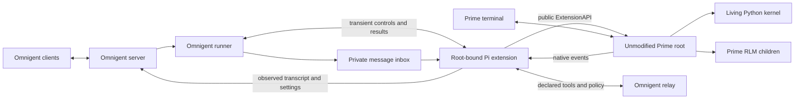

# Prime-native integration without vendor changes

This is the active design and qualification record for Omnigent's `prime-native` adapter. It supersedes the fork-dependent [architecture](DESIGN.md), [controller contract](CONTRACT.md), and [implementation sequence](IMPLEMENTATION.md). Prime remains the published, unmodified runtime. Agent Profile Kit is outside this implementation.

## Runtime ownership

Users launch `omnigent prime-native`, send messages through Prime's terminal or Omnigent, and reattach with `omnigent prime-native --resume`. The CLI-created agent is `prime-native-ui`. The [adapter guide](../../docs/PRIME_NATIVE.md) describes the public commands and HTTP controls.

The adapter uses Prime 0.9.6 and the shared Pi extension inbox, message conversion, and Omnigent tool relay. Prime-specific modules own version admission, credential-filtered model discovery, private launch configuration, controls, saved-session resume, and scoped shutdown. Omnigent does not import Prime internals, copy its engine, proxy the terminal, or replace its native worker.

Scoped shutdown uses the published supervisor command on the conversation's
qualified private socket. Omnigent retains owner records and saved history when
the socket or process state cannot prove shutdown. It does not use Prime's
root-wide CLI shutdown, whose admission lease can block another Prime startup
even when daemon discovery uses a private temporary directory. Native Windows
launch is rejected because the published default named pipe is shared.

Launch records a private reservation before its first asynchronous preparation
step. A concurrent stop returns 503 while that owner is launching, so it cannot
report success before an unregistered terminal starts. After terminal dispatch,
the reservation clears only when a recorded terminal identity is live. Failed
dispatch cleanup retains uncertain ownership for a later scoped stop. Orphan
maintenance can remove a dead owner's stale reservation after it proves runtime
absence, while it preserves a live recorded terminal.

Launch records the selected Prime executable path and configured kernel
process-name aliases in the private runtime. Cleanup uses these records to find
renamed supervisors and `rlm.repl` kernels after a socket or parent exits.

| Owner | Responsibility |
| --- | --- |
| Prime | Native terminal, authentication, available models, mutable settings, workers, kernels, tools, recursive children, scheduling, and saved history. |
| Omnigent | Private launch state, root-bound extension transport, its own controls, transcript projection, declared tool relay, root policy hook, and owned cleanup. |
| Optional Kit | Compiled resources and resource retention. No Kit repository change is included here. |
| External launcher or infrastructure | Whole-process filesystem and network confinement. That requires separate qualification. |

## Root binding and control outcomes

Prime loads external extensions into RLM children with the parent's runtime configuration. The extension determines ownership from the public `ctx.sessionManager.getHeader().rlmDepth` on `session_start`. Depth zero admits a root. Positive depth identifies a child. Missing or invalid depth is unknown and permits no root-owned side effects. Factory-time environment variables and `parentSession` cannot establish this boundary.

Only an admitted root extension consumes the Omnigent inbox and controls or forwards native identity, settings, transcript, status, usage, task state, policy, and tool calls. Recursive children remain Prime-owned execution. Child extension instances cannot replace the root control incarnation or project their transcripts as the Omnigent root conversation. This boundary does not establish descendant visibility, permission coverage, or confinement of code executed in a kernel.

A private `PrimeExtensionBinding` hides request files and acknowledgment handling. A model is an exact `PrimeModelRef(provider, model_id)`, displayed as `provider/model`. Request identity, expiry, and extension incarnation are transient control state. The extension consumes each request once and writes one result. It does not keep a second durable prompt journal or retry an uncertain mutation.

The runner maps outcomes to the statuses below. The public `/events` route retains HTTP 202 for successful interrupt and compact events. Successful compaction reports `queued: false` after its completion callback.

| Outcome | HTTP status | Meaning |
| --- | --- | --- |
| `applied` | 200 | The native setting applied and its callbacks published with HTTP 2xx, or compaction called `onComplete`. |
| `interrupt_accepted` | 202 | Prime accepted the abort call. Native interruption and settlement are separate events. |
| `rejected` | 409 | The native registry or control validation rejected the operation. |
| `unavailable` | 503 | No live admitted binding or required public API exists before mutation. |
| `unknown` | 504 | Mutation may have happened, but its result is unproved. Omnigent does not replay it. |

The shared extension is the sole mutator and observer for these controls. Active model and effort come from native observations. A delayed acknowledgment cannot overwrite a newer TUI selection. Combined settings apply model before effort and retain observed state if the later control fails. The native terminal remains independent. Omnigent does not promise global exclusivity or an atomic per-prompt model choice across clients.

Settings admitted by one runner execute in order. Interrupt and compact bypass that settings queue. A failed callback publication after native mutation returns `unknown` without replay. Model clamping requires successful publication of both the model and any effort callback. Prime 0.9.6 emits no callback for an already active model or effort; a same-value request therefore cannot establish fresh acknowledgment under this contract.

Each setting publication settles within one second or the remaining request budget, whichever is shorter. A timeout cannot prevent the server from later storing an already sent observation. A permanently hung native setter retains the extension's settings chain to prevent a later mutation from overtaking it. Interrupt remains independent. These limits provide truthful local outcomes without a rollback or a global fence.

Messages receive HTTP 202 for admission. Inbox delivery cannot publish native completion or wake a completion-dependent declared child. Running and observed waiting states protect the native pane from inactivity reaping. An actual native error or aborted result cannot become a successful idle completion. Root quiescence does not establish that all descendants have settled.

The shared executor's `TurnComplete` closes the delivery stream. Native loop ownership lives separately in native status and resource residency. Ending delivery does not release that ownership. Another admitted message can steer the active Prime loop.

## Published daemon qualification

The [disposable daemon probe](../../.agents/skills/verify-prime-native/scripts/daemon_probe.py) exercised the unmodified macOS arm64 Prime 0.9.6 release on September 29, 2026. It observed build `e260085dd8f742e0def3d871860c9a888b114851`, protocol 7, schema 30, and schema ID `protocol-7-schema-30-f908f493c9e1`. The executable SHA256 is `27bfb28d75d3f0b1fe5674b042a5127d20cbb560d00c44b42aaa905d5600f876`. Other platform artifacts need their own runtime proof.

Eight scenarios passed: negotiation, native attachment, a living Python value, completed-command deduplication, lost-reply reconciliation, supervisor adoption with an uncertain command, runtime replacement, and owned cleanup. Both wrong-result controls failed at their literal assertions. No owned process survived cleanup.

Three required scenarios failed qualification. The supervisor ignored the requested attach cursor, including invalid ahead, old-generation, and missing-history cursors, while reporting replay complete. After the tested supervisor-adoption and runtime-replacement sequence, a killed worker remained failed with no ready replacement within 30 seconds. That worker result describes the tested sequence, not every crash context.

The probe exits nonzero when any required scenario is unverified. An unchanged saved session or final tree leaf cannot prove that no replacement happened during a missed interval. A coherent snapshot cannot repair the replay contract. Durable daemon attachment and recovery are unavailable, so this implementation keeps the extension transport. It adds no daemon client or vendor workaround.

The exact released [public session header](https://github.com/PrimeIntellect-ai/prime-agent/blob/e260085dd8f742e0def3d871860c9a888b114851/packages/coding-agent/src/core/session-manager.ts) grounds the root guard. The [public extension types](https://github.com/PrimeIntellect-ai/prime-agent/blob/e260085dd8f742e0def3d871860c9a888b114851/packages/coding-agent/src/core/extensions/types.ts) ground the supported controls. Static source describes an interface. The real runtime probes determine which behaviors are qualified.

## Adapter verification

The [adapter probe](../../.agents/skills/verify-prime-native/scripts/adapter_probe.py) drives the production CLI, public session HTTP API, native terminal, real Python kernel, declared tool relay, skill delivery, policy denial, controls, recursive child boundary, and owned cleanup. Its local endpoint replaces only the remote model. Each scenario needs literal runtime observations. Negative controls must fail at the named assertion and leave no owned survivors.

The integrated adapter probe verified all ten required scenarios on September 29, 2026. It observed settings through both public interfaces, a custom Prime agent without a wrapper label, the same living Python kernel after reattachment, actual MCP and Python skill execution, root tool denial, a native compaction entry, and distinct interrupted events after API abort and terminal Ctrl+C. Each abort permitted a new literal follow-up reply. A real recursive child executed its nonce write while the root's native identity, control incarnation, and transcript remained intact. Cleanup left no owned survivors or forced cleanup. The local model fixture does not qualify commercial provider authentication. The [verification skill](../../.agents/skills/verify-prime-native/SKILL.md) records the rerunnable commands and failure signals.

All three negative controls exited 1 at their named mismatch: the wrong Python value, the wrong MCP result, and a required write marker that root policy prevented. Each qualified control left no owned survivors, forced cleanup, or cleanup errors. Evidence manifests retain the exact source and runtime hashes. Earlier scoped Python regression runs passed 661 cases. The final broader run passed 826 cases; the same five host model-catalog tests also fail on the fixed fork base. The Prime host catalog passed three tests, and the shared Pi extension passed 28 behavior checks.

A separate authenticated xAI run on revision `5001626a` verified launch, HTTP input, native terminal input, model and effort controls, kernel seed and read, living-kernel reattachment, and cleanup on Prime 0.9.6. HTTP PATCH selected `xai/grok-4.3` with high effort. Native terminal commands selected `xai/grok-4.7` with low effort. Both selections appeared in the native journal and public session state. The retained assistant completions use Grok 4.7; this does not establish generation on Grok 4.3 or provider-side effort behavior.

All eight required checks passed. Cleanup recorded no fatal errors, owned survivors, remaining credential copies, cleanup errors, or forced native fallback. This historical run predates the `c22045ea9` pane-reaper selector change. It does not qualify finite waits, MCP reconnect, or the current observer. The retained `prior-provider-run-ltiscmii/result.json` and `manifest.json` identify the run. The driver hash is `860c55abe0b2c4120019ebdc01c22851fc89ffed8b7f9680734f2395a4413909`.

The historical authenticated finite-wait run `provider-waits-m4g99h4o` passed all five
cases under its original checks on the same admitted Prime 0.9.6 artifact with
configured Grok 4.7. It ran on `c22045ea9` with provider driver SHA256
`a2584ce9b149568e791f49ace5b7be7c332493770ad771cde18cb0e20d8335bb`.
The [finite-wait workflow](../../.agents/skills/verify-prime-native/SKILL.md#qualify-authenticated-finite-waits)
provides the command and required evidence.

The runner idle control expired and the native pane idle control actually reaped.
Their positive arms completed real 60-second and 300-second Python tools after
more than 37 and 280 quiet seconds, respectively. Both accepted the exact native
queued input before tool completion, consumed it afterward, and produced the
matching native and public replies. Terminal follow-ups preserved the same
living kernel, value, and socket. A fresh wrong-memory arm failed only at its
named assertion after meeting the normal prerequisites. All five cases left no
owned survivors, private sockets, credential copies, cleanup errors, or forced
fallback. The independent audit passed 1,920 checks against the retained receipts.

Earlier journal failures and `provider-waits-ug3ppd91` remain FAILED. That run's
pane cleanup failed after session deletion removed its owned credential tree.
The passing finite-wait driver recorded session-directory deletion and rejected
recreated copies or
changed ownership. Its finite native `running` result is evidence for the recorded
source bytes only. It did not require the exact fresh public user prompt, could
report cleanup success with retained outer scratch, and could publish a passing
result before later mandatory finalization failed. The historical receipt and
its audit do not qualify the repaired contract. Genuine native `waiting`,
status-only protection during complete output silence, one-hour and indefinite
waits, and MCP reconnect remain unqualified.

## Provider probe ownership and completion

The combined repair at `ecf1bb4824a28913377109cefc3107f018fdb21a` has an independent
scoped source verdict of PASS+NOTES and 143 passing synthetic tests. Its provider
SHA256 is `e6615c5e9bd099e2d0e8fba19d291f58f435b4eb70a01fbd3c3d1223a1ff799a`.
This source verdict does not qualify a live provider or complete the roadmap.
PR6 has a separate reviewed candidate for its MCP constructor, fixture
settlement, publisher, readers, and owner pin, identified below. Fresh live WAIT
and MCP receipts are required on the final integrated bytes. Independent review
of these maintained documentation changes also remains required.

The current PR5 provider helper at `d5ef54f03ffea18116ab6757cc89a17dde5d41f8`
has SHA256 `c80b409a1511c48bd2d6f7048bc1d02d3136e4c177197a662ad98110c2f99db2`.
It rejects every present native-final error, including empty lists, empty
objects, false, zero, and whitespace-only strings. Only missing, null, and exact
empty-string errors are absent. A successful stop reason and matching literal
reply remain required. Fresh independent review of these repaired bytes is pending.

The preceding provider-only port at `a5d0703a57882800a3a0b36dc925a090b4546451`
had SHA256 `c4d86b911fd5b793ec24453c666b43c14a6736164478051f3b005085cf2847c3`.
It matched the accepted provider-only repair at
`57293032d4fe2f53bd4c688a14cac4e9fd41e930`. Its source verdict does not cover
the current final-error admission repair.
The accepted documentation at `98309e7c5136c3801bfd227e79289f2d62ed7915`
was reviewed against effective PR6 base `c0b3173d5a0a874255d9bef35c9e0c4fb895b77d`.
Its independent source review passed 925 repository cases and seven independent
checks. Those results do not qualify the current PR5 context or runtime.
Fresh PR5 source, context, runtime, base-CI, and documentation gates remain pending.
The original CLI registry omission remains unwaived until the bootstrap repair lands.

Before this PR5 repair, the separate private PR6 candidate
`cb11a4ed94a15427e7cd0a37e3847de0da0169a1` had the exact accepted
`98309e7c5136c3801bfd227e79289f2d62ed7915` tree. The repaired PR5 provider
bytes differ from that historical tree. This does not establish current whole
PR5 and PR6 tree identity.
Its MCP helper SHA256 is
`1a55d312be7c8317c898f89ff9ec37001f04a78d937b0f2e839713c7486fb435`.
That helper is absent from this PR5 checkout. PR6 remains a separate required
integration and qualification stage. PR5 production root behavior retains its
own historical 20-pass context; it does not include PR6's root-rejection repair.
Fresh final-byte WAIT and MCP receipts remain required in their respective stages.

The preceding provider SHA256 was
`45b233b559bb9b5206d8db51b4d638dff15fb32872ac2dc64f3a6814ae57c10c`.
The paired historical MCP SHA256 was
`9f47ad394e923dc6ae13c92907b81d6830a289bd4d36a7a0d2df12637fe966b4`.
Their independent cumulative review at
`094a84e198a5ebdbb5e2c6e8934b189b43fce777` covers that private source context only.

Historical MCP source review at `ad945096ed6da2c1ffe866a33841188f77770b4f`
returned PASS+NOTES for MCP SHA256
`b03472857f5cf666e026093ee664a6e58cff0858603e0e05a04bb1c24f7b7832`.
That private historical record does not establish MCP implementation or admission
on PR5. The separate PR6 candidate requires final integration review and fresh
live MCP qualification after any source or context change.

The WAIT run on private candidate `ff54be490045cbff6f4c476f4cd16ceddd6569f0`
remains FAILED. All five seed cases have false completion records and retained
allocations. Their native cause and first rejected filesystem entry remain
unknown. The later absence of 69 recorded PIDs proves only those identities
absent, not writer settlement or scratch removal. Do not retrospectively remove
those allocations using current metadata or rewrite their historical receipts.

The later audited `provider-waits-d_tb1jmg` run at
`4248f5dafee18884c8d66caa2f1480f1c619f58e` also remains FAILED. All five native
replies failed at kernel seed, before WAIT, with false committed completions.
All five lack external compact-root retirement authority. The precise DELETE
and filesystem branches and native cause remain unknown. The first case also
has a sticky `unrelated_user_process_identity_changed` failure with unknown
cause. Preserve these allocations and historical receipts. Fresh MCP execution
on the repaired source has not run.

The configured private basic-response attempt at
`4248f5dafee18884c8d66caa2f1480f1c619f58e` used the preceding provider hash
`45b233b559bb9b5206d8db51b4d638dff15fb32872ac2dc64f3a6814ae57c10c` and failed.
Its expected `OK` reply was absent, and its native final reported `agent_lifecycle_failure` despite public CLI exit
zero. Settlement failed and the daemon remained retained. Basic Prime response
is still unverified. The durable public Prime 0.9.6 installation has version and
hash checks, but no successful model-response baseline. Neither this result nor
the WAIT failures establish an authentication, provider, kernel, or installation
cause. Preserve the retained allocations and private receipts.

For the current rejected entry, inspect `<operation>-native-failure.json`.
`<operation>-native-predicates.json` marks earlier predicates as `previous_poll`.
The failure receipt contains bounded validated IDs, baseline counts, positions,
an allowlisted stop reason, error presence, and a coarse error class. Missing,
null, and empty-string errors are absent. Non-string errors are present and
malformed, including empty lists, empty objects, false, and zero. Classification
reads at most 4096 characters and records unknown or truncated state explicitly.
No native error sample, content, or hash enters this observation. A coarse class
does not attest a backend cause, provider authentication, or availability.
The fixed failure reason remains `native_assistant_not_successful`.

The failure receipt's nested `diagnostic` uses a closed finite schema. It
projects known structured diagnostic types, kinds, status and code buckets,
and matched same-operation ipython status and `isError`. It exports no raw
payload or unknown-value hash. Startup, protocol, and bootstrap flags remain
unavailable without a typed producer. Diagnostic categories do not attest the
backend cause, and previous-poll predicates cannot populate the current failure.

Qualified cleanup admits root, parent, and vnode witnesses before public DELETE
while the dedicated runner can still perform owned teardown. Public Stop
remains a separate control qualification and a cleanup attempt after DELETE
failure. A successful Stop fallback cannot clear the DELETE failure.
`retirement-attempts.json` records bounded allocation and session
bindings, reached phase, status, held identities, no-follow name state, validated
event flags, and allowlisted branches on every retirement-attempt exit.
Unknown observations remain explicit. A retained external root or DELETE 200
without the combined removal witness cannot qualify retirement. There is no
manual external-root reclamation. Sticky errors, complete settlement, captures,
and owner exit before committed publication remain required. The cooperative
namespace precondition still leaves hostile same-UID final-syscall interference
BLOCKED. See the verification skill for the exact finite observation contract.

Only `data/logs/cli/latest-cli.log` is an admitted metadata-only CLI alias.
Capture and removal receipts bind the allocation, exact path, checked parent,
and full no-follow leaf identity. Capture reads neither the alias nor its target
value. Canonical single-link regular logs are captured once. Settled writers and
matching removal-time identity permit descriptor-relative unlink of that alias.
Unknown aliases, hardlinks, replaced ancestors, and wrong allocations reject.
Traversal permits at most 32 levels, 10000 visits, and 30 seconds. Capture also
limits source bytes to 64 MiB. Exhaustion and receipt or closure errors remain
sticky. These witnesses require a cooperative namespace and do not prove
hostile same-UID exclusion in the final check/syscall window.

A reply operation retains an immutable baseline and fixed deadline. Exactly one
fresh public user message must concatenate valid `input_text` blocks to the
owned prompt without whitespace normalization. The match must follow the
baseline and precede the selected final, with no intervening public user.
A stale, duplicate, late, or malformed match rejects. Earlier different wait
input is allowed. Missing or wrong text stays pending until the fixed deadline.
Captures retain counts, positions, freshness, equality, and the selected final
position. Native user, public user, native final, and public final have separate
IDs. A user's response ID need not equal the final's response ID. Native tool
ordering and the complete ordered public projection remain required.

`_RuntimeOwner.allocate(request, evidence)` owns scratch before `_OwnedRun`
construction. The owner guard covers entry and partial subclass construction.
Unknown construction cannot manufacture settlement. `cleanup(external_settlement)`
requires an allocation-bound `_ExternalSettlement`. Provider-only cases use
`no_fixture`. Fixture callers must record all generations, processes, readers,
handles, threads, and endpoints closed before supplying `settled_fixture` with
retained evidence. Failure or uncertainty requires `failed_fixture` with errors.
The actual PR6 branch still needs independent review of its integrated fixture
lifecycle proof. Historical private MCP review does not admit that branch.

Process census, sanitized capture completion, closed readers and sockets, source
checks, and explicit fixture settlement precede recursive scratch mutation.
External compact roots need independent retirement receipts. No-follow
descriptor-relative traversal checks identity and rejects unsafe descendants
and observed substitution. There is no pathname deletion fallback or parent
sweep. Failures before removal retain uncertain scratch. Once removal is proved,
the owner retains removed provenance before receipt I/O or closure. Later errors
remain sticky and block success. Retired credential retries inspect only known
witnessed targets without rediscovery or deletion of recreated names. New
registrations beneath retired roots reject.

The CLI caller must explicitly admit `--cooperative-cleanup`. A programmatic
caller must pass `cooperative_cleanup=True` with the other required `Request`
arguments. This precondition means a controlled namespace with all recorded
owned writers settled and no hostile
concurrent namespace writer. Permissions, mutexes, and watches do not enforce
exclusion of arbitrary hostile same-UID writers. Interference between the final
check and syscall remains BLOCKED, not a passing substitution control.

On the admitted Darwin/APFS host, the removal predicate continuously holds the
original directory and parent descriptors with device, inode, type, ancestor,
and permitted-alias witnesses. It requires a registered and validated original
vnode watch, an empty prior-event admission poll, and successful checked
descriptor-relative final `rmdir`. The original must report `NOTE_DELETE` and
unchanged held device, inode, and directory type. Surviving parents, ancestors,
and aliases must still match, and the original name must be absent under a
no-follow lookup. Observed rename/revoke, watch errors, missing events,
substitution, and recreated names reject qualification.

Link count and `NOTE_LINK` are diagnostic only. Genuine removal on the grounded
APFS host retained `st_nlink == 2`. The earlier zero-link predicate and its failed
receipts remain historical evidence, not the current admission requirement.
Name absence alone accepts rename-away. `NOTE_DELETE` alone can describe
rename-over while a replacement remains. The combined predicate proves original
vnode namespace removal under the cooperative precondition. It does not prove
physical reclamation, secure erasure, snapshot destruction, hostile exclusion,
or exhaustive event history. Kqueue flags can coalesce.

`runtime-settlement.json` records the settled run. `runtime-removal.json` binds
the allocation to the original root, parent, deletion event, and namespace-removal
precondition. `runtime-owner.json` must record that allocation removed, the owner
closed, and no errors. Session `retired_owned_trees` records retain their separate
session DELETE operation and HTTP status. Outer scratch proof uses its actual
`rmdir`, with no invented session operation.

The guarded run returns an unpublished `_CaseDraft`. Owner exit, required
receipts, credential finalization, and pin/watch closure finish before
`_publish_case`. Result and manifest `qualified` values are provisional.
Publication inventories, hashes, flushes, and closes artifacts before the final
rename commits `completion.json`. Its `result_sha256` and `manifest_sha256` bind
success to exact retained bytes. No mandatory owner operation follows that
successful rename. `CaseResult.passed`, wrong-memory control acceptance, CLI,
and aggregate results require committed matching hashes. The wrong-memory child
must commit a false result at its named mismatch with verified cleanup.
Missing completion, failed preparation, or mismatched hashes cannot authorize
success. Never rewrite historical receipts to meet this new contract.

## Original acceptance criteria

Every original ID remains visible. The [literal acceptance requirements](CONTRACT.md#acceptance-matrix) remain unchanged. A narrower passing observation does not qualify a stronger original guarantee.

| ID | Current disposition |
| --- | --- |
| N01 | Implemented native registration, `prime-native` harness, and `prime-native-ui` CLI agent. |
| N02 | Reframed and implemented without a vendor bridge. Exact Prime version admission and Omnigent control outcomes replace the fork dependency. |
| N03 | Model and effort controls verified through HTTP and the native terminal, including a custom agent without a wrapper label. Separate authenticated xAI qualification on `5001626a` passed model and effort control changes between Grok 4.3 and 4.7. Other providers remain unqualified. |
| N04 | Prime base instructions, a custom agent nonce, and canonical Omnigent framework instructions observed in actual model requests. Kit delivery is external. |
| N05 | Bundled skill instructions and the exact declared Python resource delivered through `load_skill` and `read_skill_file`. The living kernel executed that resource and produced its literal result and nonce file. |
| N06 | Native attachment and live terminal reattachment implemented and verified by the baseline helper. |
| N07 | A literal Python value survived HTTP-to-terminal reattachment in the same living kernel, with unchanged PID and process start time. This does not qualify memory after restart. |
| N08 | Durable stable-root recovery remains blocked by the published daemon gate. Saved-history resume does not preserve a restarted kernel. |
| N09 | Gap, generation, and snapshot projection guarantees remain blocked by the published daemon gate. |
| N10 | Omnigent's own transient settings are serialized. Global exclusivity across arbitrary native clients remains unmet. |
| N11 | API abort and terminal Ctrl+C produced distinct native interrupted events and successful subsequent turns. Admission, interruption, detach, and owned stop remain distinct. Remote admission cancellation is unqualified. |
| N12 | Rich output types remain deferred until individually qualified. |
| N13 | Qualified model, effort, compact, and interrupt controls have explicit outcomes. Unsupported controls reject explicitly. Arbitrary dialogs remain unqualified. |
| N14 | A real Prime RLM child executed a nonce write without replacing the root's native identity, control incarnation, or transcript. Prime recursive lineage remains separate from Omnigent declared roles. Full descendant visibility is unqualified. |
| N15 | Mixed declared-role compositions and completion-dependent Prime children remain unsupported. |
| N16 | Prime's native long-running controls remain available in its terminal. Omnigent goals, heartbeat, and schedule controls need separate qualification. |
| N17 | Historical source-bound evidence only. Fresh final-byte WAIT qualification remains pending. Actual 60-second and 300-second native Python tools passed with matched runner and pane idle controls, timely native queued input, subsequent replies, living-kernel reattachment, and clean cleanup. Genuine native `waiting`, status-only protection during complete output silence, one-hour and indefinite waits remain unqualified. |
| N18 | Inbox delivery is admission, not completion. Root quiescence is observed. Whole-descendant settlement remains unqualified. |
| N19 | A declared MCP tool executed through Omnigent's relay with its literal result. The wrong-result control failed at that assertion with clean cleanup. Reconnect availability is unqualified. |
| N20 | Root relayed write denial verified through HTTP and terminal input with absent marker files. The opposite side-effect control failed at its named assertion. Universal allow, deny, approval, native-client, and descendant coverage remains unmet. |
| K01 | External. Prime remains an optional Kit target. |
| K02 | External. Equal compiled resource digests for direct Prime and Omnigent delivery need Kit proof. |
| K03 | External. Kit inspection, conflict, retry, rollback, removal, and recovery need Kit proof. |
| K04 | External. Living and resumable resource pinning needs Kit proof. |
| K05 | Adapter private mutable state remains separate from source configuration. Kit removal behavior is external. |
| S01 | Whole-tree filesystem confinement is unqualified. A root tool veto cannot establish it. |
| S02 | Whole-tree network confinement is unqualified. |
| S03 | Private runtime ownership does not qualify endpoint isolation from a contained process. |
| S04 | Historical local cleanup receipts are source-bound and do not prove outer scratch removal. The repaired owner has synthetic namespace-removal evidence under a cooperative precondition. Fresh live WAIT/MCP qualification, hostile final-window safety, and whole external-boundary teardown remain unqualified. |
| M01 | Published 0.9.6 is the admitted release. The failed daemon proof prevents stronger compatibility claims. |
| M02 | Vendor patches are excluded. The adapter uses public extension APIs and explicit unsupported outcomes. |

The original 31-item program remains incomplete. The Omnigent implementation advances the supported subset without treating Kit, durable daemon recovery, global fencing, or whole-tree containment as delivered.

## Design choices

Boundary Discipline keeps released protocol and extension facts at their respective adapter boundaries. Separate Before Serializing Shared State keeps RLM children out of the root's shared files and projection. Model the Domain gives control outcomes distinct meanings. Prove It Works requires real runtime observations before upgrading any acceptance disposition.
