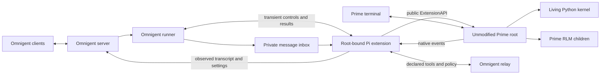

# Prime-native integration without vendor changes

This is the active design and qualification record for Omnigent's `prime-native` adapter. It supersedes the fork-dependent [architecture](DESIGN.md), [controller contract](CONTRACT.md), and [implementation sequence](IMPLEMENTATION.md). Prime remains the published, unmodified runtime. Agent Profile Kit is outside this implementation.

## Runtime ownership

Users launch `omnigent prime-native`, send messages through Prime's terminal or Omnigent, and reattach with `omnigent prime-native --resume`. The CLI-created agent is `prime-native-ui`. The [adapter guide](../../docs/PRIME_NATIVE.md) describes the public commands and HTTP controls.

The adapter uses Prime 0.9.6 and the shared Pi extension inbox, message conversion, and Omnigent tool relay. Prime-specific modules own version admission, credential-filtered model discovery, private launch configuration, controls, saved-session resume, and scoped shutdown. Omnigent does not import Prime internals, copy its engine, proxy the terminal, or replace its native worker.

The [adapter lifecycle guide](../../docs/PRIME_NATIVE.md#state-and-compatibility)
owns scoped shutdown, unreadable-process ownership, runtime retention, and
platform constraints.

Launch records a private reservation before its first asynchronous preparation
step. Closure remains unqualified while that owner is launching, so Stop cannot
report verified shutdown before an unregistered terminal starts. After terminal dispatch,
the reservation clears only when a recorded terminal identity is live. Failed
dispatch cleanup retains uncertain ownership for a later scoped stop. Orphan
maintenance can remove a dead owner's stale reservation after it proves runtime
absence, while it preserves a live recorded terminal.

The terminal registry admits one launch at a time for each conversation,
terminal name, and session key, including calls from separate event loops.
Same-key callers wait before preparation and reconcile any retained owner
before dispatch. Cancelling a waiter leaves the active launch intact. Other
keys remain independent, and close still qualifies the exact terminal owner.

The server's private source epoch fences delayed startup and input after Stop.
A different-agent fork checks verified closure in its destination insertion
transaction. [The Stop workflow](../../docs/NATIVE_STOP.md) describes owner and
reader permissions, unsupported outcomes, and resume invalidation.

Launch records the selected Prime executable path and configured kernel
process-name aliases in the private runtime. Cleanup uses these records to find
renamed supervisors and `rlm.repl` kernels after a socket or parent exits.

| Owner | Responsibility |
| --- | --- |
| Prime | Native terminal, authentication, available models, mutable settings, workers, kernels, tools, recursive children, scheduling, and saved history. |
| Omnigent | Private launch state, root-bound extension transport, its own controls, transcript projection, declared tool relay, root policy hook, and owned cleanup. |
| Optional Kit | Compiled resources and resource retention. No Kit repository change is included here. |
| External launcher or infrastructure | Whole-process filesystem and network confinement. That requires separate qualification. |

## Root binding and control outcomes

Prime loads external extensions into RLM children with the parent's runtime configuration. The extension determines ownership from the public `ctx.sessionManager.getHeader().rlmDepth` on `session_start`. Depth zero admits a root. Positive depth identifies a child. Missing or invalid depth is unknown and permits no root-owned side effects. Factory-time environment variables and `parentSession` cannot establish this boundary.

Only an admitted root extension consumes the Omnigent inbox and controls or forwards native identity, settings, transcript, status, usage, task state, policy, and tool calls. Recursive children remain Prime-owned execution. Child extension instances cannot replace the root control incarnation or project their transcripts as the Omnigent root conversation. This boundary does not establish descendant visibility, permission coverage, or confinement of code executed in a kernel.

A private `PrimeExtensionBinding` hides request files and acknowledgment handling. A model is an exact `PrimeModelRef(provider, model_id)`, displayed as `provider/model`. Request identity, expiry, and extension incarnation are transient control state. The extension consumes each request once and writes one result. It does not keep a second durable prompt journal or retry an uncertain mutation.

The runner maps outcomes to the statuses below. The public `/events` route retains HTTP 202 for successful interrupt and compact events. Successful compaction reports `queued: false` after its completion callback.

| Outcome | HTTP status | Meaning |
| --- | --- | --- |
| `applied` | 200 | The native setting applied and its callbacks published with HTTP 2xx, or compaction called `onComplete`. |
| `interrupt_accepted` | 202 | Prime accepted the abort call. Native interruption and settlement are separate events. |
| `rejected` | 409 | The native registry or control validation rejected the operation. |
| `unavailable` | 503 | No live admitted binding or required public API exists before mutation. |
| `unknown` | 504 | Mutation may have happened, but its result is unproved. Omnigent does not replay it. |

The shared extension is the sole mutator and observer for these controls. Active model and effort come from native observations. A delayed acknowledgment cannot overwrite a newer TUI selection. Combined settings apply model before effort and retain observed state if the later control fails. The native terminal remains independent. Omnigent does not promise global exclusivity or an atomic per-prompt model choice across clients.

Settings admitted by one runner execute in order. Interrupt and compact bypass that settings queue. A failed callback publication after native mutation returns `unknown` without replay. Model clamping requires successful publication of both the model and any effort callback. Prime 0.9.6 emits no callback for an already active model or effort; a same-value request therefore cannot establish fresh acknowledgment under this contract.

Each setting publication settles within one second or the remaining request budget, whichever is shorter. A timeout cannot prevent the server from later storing an already sent observation. A permanently hung native setter retains the extension's settings chain to prevent a later mutation from overtaking it. Interrupt remains independent. These limits provide truthful local outcomes without a rollback or a global fence.

Messages receive HTTP 202 for admission. Inbox delivery cannot publish native completion or wake a completion-dependent declared child. Running and observed waiting states protect the native pane from inactivity reaping. An actual native error or aborted result cannot become a successful idle completion. Root quiescence does not establish that all descendants have settled.

The shared executor's `TurnComplete` closes the delivery stream. Native loop ownership lives separately in native status and resource residency. Ending delivery does not release that ownership. Another admitted message can steer the active Prime loop.

## Native observation recovery

The extension records its current loop and one unacknowledged final observation in the private control directory. Each record names its binding incarnation and sequence. Status publication runs independently of native callbacks, with one request in flight and a one-second deadline. The runner also reconciles these records from the terminal watcher. A successful status reply requires both runner ownership application and the server's metadata transaction. Repeating an observation still contacts the runner after server or runner restart.

A new initial delivery has a runner-issued delivery ID, ownership generation, and starting native sequence. Its pending state is persisted before admission succeeds. A prior idle record cannot settle that reservation. A known rejection before inbox admission can settle only the matching initial reservation. Rejected steering leaves its native loop active. The extension quarantines an inbox item before calling Prime. An SDK exception leaves delivery unknown and does not resend the input. Retained delivery failures produce error items through bounded reconciliation. Admission rejects when 128 unsettled delivery records or quarantined inputs remain.

The metadata transaction keeps native observations, awaiting delivery, and a required-terminal failure distinct. A terminal failure carries the exact terminal instance and ownership generation. Replacement bindings and later native starts invalidate older failures. Public snapshots and lists use the persisted projection after cache loss. Private binding and delivery records are excluded from public response schemas.

Policy and Plan updates preserve the current owner's private observations and owner revision. Upstream v0.17.0 reserves the in-place `switch-agent` route and returns HTTP 410. To change agents, fork the conversation with the selected destination agent. A native source requires an explicit owner Stop with verified shutdown before a different-agent fork. The [Stop and fork guide](../../docs/NATIVE_STOP.md) describes owner and reader permissions and unknown outcomes.

A newer authenticated idle receipt clears a previous published failure even when the newer running edge was missed. The server publishes the runner's actual current state before acknowledging that receipt.

Direct terminal activity can overrun the retained final slot. The extension preserves the latest state and marks a historical gap. It does not reconstruct missed successful completions or replay mutations. These adapter records do not repair the published daemon's replay or kernel-restart limitations.

Live recovery after rejected or hung final-status publication remains unqualified on this release. Qualification requires the matching response, an actual successful retry, released runner ownership, cleared public active response, a fresh reply, and owned cleanup. SDK post-admission exception timing still needs a real published-runtime trigger. Injected executor exceptions establish adapter behavior only.

## Published daemon qualification

The [disposable daemon probe](../../.agents/skills/verify-prime-native/scripts/daemon_probe.py) exercised the unmodified macOS arm64 Prime 0.9.6 release on September 29, 2026. It observed build `e260085dd8f742e0def3d871860c9a888b114851`, protocol 7, schema 30, and schema ID `protocol-7-schema-30-f908f493c9e1`. The executable SHA256 is `27bfb28d75d3f0b1fe5674b042a5127d20cbb560d00c44b42aaa905d5600f876`. Other platform artifacts need their own runtime proof.

Eight scenarios passed: negotiation, native attachment, a living Python value, completed-command deduplication, lost-reply reconciliation, supervisor adoption with an uncertain command, runtime replacement, and owned cleanup. Both wrong-result controls failed at their literal assertions. No owned process survived cleanup.

Three required scenarios failed qualification. The supervisor ignored the requested attach cursor, including invalid ahead, old-generation, and missing-history cursors, while reporting replay complete. After the tested supervisor-adoption and runtime-replacement sequence, a killed worker remained failed with no ready replacement within 30 seconds. That worker result describes the tested sequence, not every crash context.

The probe exits nonzero when any required scenario is unverified. An unchanged saved session or final tree leaf cannot prove that no replacement happened during a missed interval. A coherent snapshot cannot repair the replay contract. Durable daemon attachment and recovery are unavailable, so this implementation keeps the extension transport. It adds no daemon client or vendor workaround.

The exact released [public session header](https://github.com/PrimeIntellect-ai/prime-agent/blob/e260085dd8f742e0def3d871860c9a888b114851/packages/coding-agent/src/core/session-manager.ts) grounds the root guard. The [public extension types](https://github.com/PrimeIntellect-ai/prime-agent/blob/e260085dd8f742e0def3d871860c9a888b114851/packages/coding-agent/src/core/extensions/types.ts) ground the supported controls. Static source describes an interface. The real runtime probes determine which behaviors are qualified.

## Adapter verification

The [adapter probe](../../.agents/skills/verify-prime-native/scripts/adapter_probe.py) drives the production CLI, public session HTTP API, native terminal, real Python kernel, declared tool relay, skill delivery, policy denial, controls, recursive child boundary, and owned cleanup. Its local endpoint replaces only the remote model. Each scenario needs literal runtime observations. Negative controls must fail at the named assertion and leave no owned survivors.

The integrated adapter probe verified all ten required scenarios on September 29, 2026. It observed settings through both public interfaces, a custom Prime agent without a wrapper label, the same living Python kernel after reattachment, actual MCP and Python skill execution, root tool denial, a native compaction entry, and distinct interrupted events after API abort and terminal Ctrl+C. Each abort permitted a new literal follow-up reply. A real recursive child executed its nonce write while the root's native identity, control incarnation, and transcript remained intact. Cleanup left no owned survivors or forced cleanup. The local model fixture does not qualify commercial provider authentication. The [verification skill](../../.agents/skills/verify-prime-native/SKILL.md) records the rerunnable commands and failure signals.

All three negative controls exited 1 at their named mismatch: the wrong Python value, the wrong MCP result, and a required write marker that root policy prevented. Each qualified control left no owned survivors, forced cleanup, or cleanup errors. Evidence manifests retain the exact source and runtime hashes. Earlier scoped Python regression runs passed 661 cases. The final broader run passed 826 cases; the same five host model-catalog tests also fail on the fixed fork base. The Prime host catalog passed three tests, and the shared Pi extension passed 28 behavior checks.

A separate authenticated xAI run on revision `5001626a` verified launch, HTTP input, native terminal input, model and effort controls, kernel seed and read, living-kernel reattachment, and cleanup on Prime 0.9.6. HTTP PATCH selected `xai/grok-4.3` with high effort. Native terminal commands selected `xai/grok-4.7` with low effort. Both selections appeared in the native journal and public session state. The retained assistant completions use Grok 4.7; this does not establish generation on Grok 4.3 or provider-side effort behavior.

All eight required checks passed. Cleanup recorded no fatal errors, owned survivors, remaining credential copies, cleanup errors, or forced native fallback. This historical run predates the `c22045ea9` pane-reaper selector change. It does not qualify finite waits, MCP reconnect, or the current observer. The retained `prior-provider-run-ltiscmii/result.json` and `manifest.json` identify the run. The driver hash is `860c55abe0b2c4120019ebdc01c22851fc89ffed8b7f9680734f2395a4413909`.

The historical authenticated finite-wait run `provider-waits-m4g99h4o` passed all five
cases under its original checks on the same admitted Prime 0.9.6 artifact with
configured Grok 4.7. It ran on `c22045ea9` with provider driver SHA256
`a2584ce9b149568e791f49ace5b7be7c332493770ad771cde18cb0e20d8335bb`.
The [finite-wait workflow](../../.agents/skills/verify-prime-native/SKILL.md#qualify-authenticated-finite-waits)
provides the command and required evidence.

The runner idle control expired and the native pane idle control actually reaped.
Their positive arms completed real 60-second and 300-second Python tools after
more than 37 and 280 quiet seconds, respectively. Both accepted the exact native
queued input before tool completion, consumed it afterward, and produced the
matching native and public replies. Terminal follow-ups preserved the same
living kernel, value, and socket. A fresh wrong-memory arm failed only at its
named assertion after meeting the normal prerequisites. All five cases left no
owned survivors, private sockets, credential copies, cleanup errors, or forced
fallback. The independent audit passed 1,920 checks against the retained receipts.

Earlier journal failures and `provider-waits-ug3ppd91` remain FAILED. That run's
pane cleanup failed after session deletion removed its owned credential tree.
The passing finite-wait driver recorded session-directory deletion and rejected
recreated copies or
changed ownership. Its finite native `running` result is evidence for the recorded
source bytes only. It did not require the exact fresh public user prompt, could
report cleanup success with retained outer scratch, and could publish a passing
result before later mandatory finalization failed. The historical receipt and
its audit do not qualify the repaired contract. Genuine native `waiting`,
status-only protection during complete output silence, one-hour and indefinite
waits remain unqualified. Historical MCP evidence has the separate bounded
qualification below.

The parent finite-wait run `provider-waits-gkknmv6b` passed five cases on revision
`afe870ce93c9df8bccfa88be13bb54c39d64e5ae` with the same provider driver hash.
It shares the prompt, outer-scratch, and publication limits above.
The independent receipt audit passed 2,616 assertions over 309 child artifacts
and 897 selected source files. All 72 recorded owned process identities were
absent. The runner positive tool lasted 60.007 seconds with 37.432 quiet seconds.
The pane positive tool lasted 300.004 seconds with 280.224 quiet seconds.
Both idle controls expired, and pane idle actually reaped. The fresh wrong-memory
control failed only at `memory_read_mismatch`. Every cleanup was verified.
Earlier indexed failed runs, including `wy9dvn9_`, remain FAILED. The parent
also passed 55 registry and reaper tests. These parent results do not qualify
the later MCP and extension changes. No finite-wait rerun on those changed bytes
is claimed. Gateway retry behavior, daemon recovery, global exclusivity, and
descendant guarantees remain separate gaps.

## Regular HTTP MCP reconnect qualification

The retained `provider-mcp-nhuedn43/runner-mcp-gimauabc` probe reports
`passed: true` and all eight required claims `VERIFIED`. It used configured xAI
credentials and Grok 4.7 with published Prime 0.9.6 build `e260085d` on macOS
arm64. This is one declared regular HTTP MCP case, measured on the MCP working
tree above `afe870ce93c9df8bccfa88be13bb54c39d64e5ae`. The receipt's source hashes
identify the repaired connection, runner route, extension, and probe. The HEAD
alone does not identify those uncommitted bytes or establish a final commit run.

Generation 1 returned the declared tool's exact literal in the fixture ledger,
native result, and provider continuation. The probe stopped the server and
confirmed connection refusal. The next native call completed with `isError: true`
and the runner error prefix. No fixture invocation fabricated the outage.
Only after that error completed did generation 2 start at the same endpoint with
the same schema, a distinct PID, and a fresh startup nonce. A separate declared
call then returned the generation-2 literal in all three witnesses. The selected
root and living kernel remained the same. The seeded token matched, the count
advanced from 41 to 42, and a socket descriptor remained open in the same kernel.
These checks do not prove object or socket identity, or a connected peer.
Cleanup recorded no errors, owned survivors, private sockets, credential copies,
or forced fallback.

The [MCP verification workflow](../../.agents/skills/verify-prime-native/SKILL.md#qualify-regular-http-mcp-reconnect)
provides the repeat command and required receipts. Evidence remains private.
This historical result predates explicit fixture settlement and completion
publication. It does not qualify the migrated MCP driver or current outer
scratch removal. Fresh WAIT and MCP receipts must identify the final integrated
bytes before either repaired contract can be qualified.
The three earlier actual runs `provider-mcp-p6dnmwnf`, `provider-mcp-kt9j16e_`,
and `provider-mcp-94f7fnro` remain FAILED with their original reasons.

Controlled source verification passed 261 focused cases, 46 extension cases,
and six independent private cases. Five source mutations produced 16 expected
failing cases. Pi 0.84.2 error-mapping checks model selected SDK source semantics.
They do not execute the SDK or run the Pi CLI. The actual Prime probe above
qualifies the selected native error transport and recovery sequence.

Real MRTR callbacks and opaque approval retries across restart, stdio restart,
wider errors, cancellation and deadline behavior, other server classes, and
other providers remain unqualified. Connection retries remain at-least-once and
cannot reconstruct lost server approval state. This result does not complete N19.

## Provider probe ownership and completion

The combined repair at `ecf1bb4824a28913377109cefc3107f018fdb21a` has an independent
scoped source verdict of PASS+NOTES and 143 passing synthetic tests. Its provider
SHA256 is `e6615c5e9bd099e2d0e8fba19d291f58f435b4eb70a01fbd3c3d1223a1ff799a`.
This source verdict does not qualify a live provider or complete the roadmap.
The historical private PR6 composition combined accepted PR6
`1f5a8e4d6fb678a5ed65bc1021a3d018695e03a2` with the actual PR5 merge
`63b3d78f14fd23f68b651c989eb0a0e0fd8b2c19`. The accepted PR6 review returned
Source PASS+NOTES and documentation PASS, with 950 source cases and 20 controls.
Those results describe the old PR6 context. Fresh independent source and
documentation review of this composition remains required.

The MCP helper's [`OWNER_SHA256`](../../.agents/skills/verify-prime-native/scripts/mcp_probe.py)
owns the admitted provider helper hash.
At Source `3ac1fd1b2abca91e8973f059fd9d4cd8b6bcbb9c`, the MCP helper SHA256 was
`b382a4c1bff9e313e0ef53a5cb81ce391e1f8f1b5c63d06f92b08366dfd6b466`.
The historical repaired MCP helper SHA256 was
`043dab4e5c213dbd87ffe6f3ef49a59d3e4fa8d1f30563e7633d71314a50b6a4`.
Its fixture close fallback reaps the exact registered child even when identity
metadata capture fails. The original failure remains sticky.
Every present native-final error rejects, including empty containers, false,
zero, and whitespace-only
strings. Only missing, null, and exact empty-string errors are absent.
A successful stop reason and matching literal reply remain required.

The current root rejection and task-error contract is documented in
[Use declared resources](../../docs/PRIME_NATIVE.md#use-declared-resources).
PR5's historical standalone 20-case root context does not replace that contract.
Its earlier source review at `e1aa5176782d2cce6d50ad9e2115977339143a5c` passed
854 context cases and 69 controls. The parent failed 21 controls and passed 48.
These historical counts are unchanged and are not fresh composition results.

The actual PR5 merge has the reviewed `fd2b0b4bbaf52cecf7bc34129ef6804c0fdd14c3`
tree. It brings Main's bootstrap, CRDB, CLI registry, and agent-name index
repairs, the OAuth prerequisite correction, and two literal-readiness waits.
The earlier registry failure and Linux empty-readiness failure remain historical.
Linux misc CI passed at fd2. That result does not qualify this new composition
or any native runtime. The imported registry fix requires a fresh scoped check.
These historical source reviews do not qualify actual MCP calls, provider
acceptance, or live WAIT behavior on the current source. Full S01-S04 and the
31-requirement program remain incomplete.

Historical composition failures remain part of the evidence. One prior strict
clean precheck failed before its owner proceeded. A broad CLI test selection
started API/server, host, and zygote processes outside that unit's scope and
reported 442 passes and three failures. Reported reaping did not prove exhaustive
cleanup. The recorder failure, index.lock failure, initial timing gap, Android
no-op wrappers, and five CRDB backend skips remain historical limitations.
The later stopped PR6 attempt lost precheck terminal metadata and its process
diagnostic raised a Python SyntaxError. Neither attempt supplies this
composition's verification or changes any runtime acceptance status.

The prior PR6 candidate `cb11a4ed94a15427e7cd0a37e3847de0da0169a1` had the
exact reviewed `98309e7c5136c3801bfd227e79289f2d62ed7915` tree against
base `c0b3173d5a0a874255d9bef35c9e0c4fb895b77d`. Its 925 repository cases
and seven independent checks are historical evidence for that composition.
Its provider SHA256 was
`c4d86b911fd5b793ec24453c666b43c14a6736164478051f3b005085cf2847c3`,
and its MCP SHA256 was
`1a55d312be7c8317c898f89ff9ec37001f04a78d937b0f2e839713c7486fb435`.
The provider-only port at `a5d0703a57882800a3a0b36dc925a090b4546451`
matched `57293032d4fe2f53bd4c688a14cac4e9fd41e930`. These historical
identities do not establish current PR5 and PR6 whole-tree identity or runtime
qualification.

The preceding provider SHA256 was
`45b233b559bb9b5206d8db51b4d638dff15fb32872ac2dc64f3a6814ae57c10c`.
The paired historical MCP SHA256 was
`9f47ad394e923dc6ae13c92907b81d6830a289bd4d36a7a0d2df12637fe966b4`.
Their independent cumulative review at
`094a84e198a5ebdbb5e2c6e8934b189b43fce777` covers that source context only.
Historical MCP review at `ad945096ed6da2c1ffe866a33841188f77770b4f`
returned PASS+NOTES for MCP SHA256
`b03472857f5cf666e026093ee664a6e58cff0858603e0e05a04bb1c24f7b7832`.
Fresh final-byte WAIT and MCP receipts remain required after source or context
changes.

The WAIT run on private candidate `ff54be490045cbff6f4c476f4cd16ceddd6569f0`
remains FAILED. All five seed cases have false completion records and retained
allocations. Their native cause and first rejected filesystem entry remain
unknown. The later absence of 69 recorded PIDs proves only those identities
absent, not writer settlement or scratch removal. Do not retrospectively remove
those allocations using current metadata or rewrite their historical receipts.

The later audited `provider-waits-d_tb1jmg` run at
`4248f5dafee18884c8d66caa2f1480f1c619f58e` also remains FAILED. All five native
replies failed at kernel seed, before WAIT, with false committed completions.
All five lack external compact-root retirement authority. The precise DELETE
and filesystem branches and native cause remain unknown. The first case also
has a sticky `unrelated_user_process_identity_changed` failure with unknown
cause. Preserve these allocations and historical receipts. Fresh MCP execution
on the repaired source has not run.

The configured private basic-response attempt at
`4248f5dafee18884c8d66caa2f1480f1c619f58e` used the preceding provider hash
`45b233b559bb9b5206d8db51b4d638dff15fb32872ac2dc64f3a6814ae57c10c` and failed.
Its expected `OK` reply was absent, and its native final reported `agent_lifecycle_failure` despite public CLI exit
zero. Settlement failed and the daemon remained retained. That attempt did not
establish a successful basic response. The installation's version and hash
checks did not establish a model-response baseline. Neither this result nor
the WAIT failures establish an authentication, provider, kernel, or installation
cause. Preserve the retained allocations and private receipts.

A later sanitized basic-receipt review records the actual basic response as
FAILED with `xai_no_usable_credential` and unknown cause. Finite shutdown and
known PID/socket absence do not prove normal/full settlement, a successful
response, exhaustive descendants, credential-source comparison, removal, or
future custody. That failed attempt did not establish a model-response baseline.

After the operator reported normal xAI login, a later direct Prime 0.9.6 print
request returned exactly `OK` followed by a newline and exited zero. It requested `xai/grok-4.7`
and thinking `off`. Active provider, model, thinking, and effort were not
independently observed. The requested settings do not establish a credential class.
This direct CLI baseline does not qualify Omnigent terminal and HTTP responses,
installed-source equivalence, authentic resource Source and budgets, or full
descendant settlement. Earlier failed receipts remain failed.

For the current rejected entry, inspect `<operation>-native-failure.json`.
`<operation>-native-predicates.json` marks earlier predicates as `previous_poll`.
The failure receipt contains bounded validated IDs, baseline counts, positions,
an allowlisted stop reason, error presence, and a coarse error class. Missing,
null, and empty-string errors are absent. Non-string errors are present and
malformed, including empty lists, empty objects, false, and zero. Classification
reads at most 4096 characters and records unknown or truncated state explicitly.
No native error sample, content, or hash enters this observation. A coarse class
does not attest a backend cause, provider authentication, or availability.
The fixed failure reason remains `native_assistant_not_successful`.

The failure receipt's nested `diagnostic` uses a closed finite schema. It
projects known structured diagnostic types, kinds, status and code buckets,
and matched same-operation ipython status and `isError`. It exports no raw
payload or unknown-value hash. Startup, protocol, and bootstrap flags remain
unavailable without a typed producer. Diagnostic categories do not attest the
backend cause, and previous-poll predicates cannot populate the current failure.

Qualified cleanup admits root, parent, and vnode witnesses before public DELETE
while the dedicated runner can still perform owned teardown. Public Stop
remains a separate control qualification and a cleanup attempt after DELETE
failure. A successful Stop fallback cannot clear the DELETE failure.
`retirement-attempts.json` records bounded allocation and session
bindings, reached phase, status, held identities, no-follow name state, validated
event flags, and allowlisted branches on every retirement-attempt exit.
Unknown observations remain explicit. The [verification workflow](../../.agents/skills/verify-prime-native/SKILL.md#qualify-authenticated-finite-waits)
owns the retirement requirements during DELETE and after maintenance removal. There is no
manual external-root reclamation. Sticky errors, complete settlement, captures,
and owner exit before committed publication remain required. The cooperative
namespace precondition still leaves hostile same-UID final-syscall interference
BLOCKED. See the verification skill for the exact finite observation contract.

Only `data/logs/cli/latest-cli.log` is an admitted metadata-only CLI alias.
Capture and removal receipts bind the allocation, exact path, checked parent,
and full no-follow leaf identity. Capture reads neither the alias nor its target
value. Canonical single-link regular logs are captured once. Settled writers and
matching removal-time identity permit descriptor-relative unlink of that alias.
Unknown aliases, hardlinks, replaced ancestors, and wrong allocations reject.
Traversal permits at most 32 levels, 10000 visits, and 30 seconds. Capture also
limits source bytes to 64 MiB. Exhaustion and receipt or closure errors remain
sticky. These witnesses require a cooperative namespace and do not prove
hostile same-UID exclusion in the final check/syscall window.

A reply operation retains an immutable baseline and fixed deadline. Exactly one
fresh public user message must concatenate valid `input_text` blocks to the
owned prompt without whitespace normalization. The match must follow the
baseline and precede the selected final, with no intervening public user.
A stale, duplicate, late, or malformed match rejects. Earlier different wait
input is allowed. Missing or wrong text stays pending until the fixed deadline.
Captures retain counts, positions, freshness, equality, and the selected final
position. Native user, public user, native final, and public final have separate
IDs. A user's response ID need not equal the final's response ID. Native tool
ordering and the complete ordered public projection remain required.

`_RuntimeOwner.allocate(request, evidence)` owns scratch before `_OwnedRun`
construction. The owner guard covers entry and partial subclass construction.
Unknown construction cannot manufacture settlement. `cleanup(external_settlement)`
requires an allocation-bound `_ExternalSettlement`. Provider-only cases use
`no_fixture`. Fixture callers must record all generations, processes, readers,
handles, threads, and endpoints closed before supplying `settled_fixture` with
retained evidence. Failure or uncertainty requires `failed_fixture` with errors.
The migrated MCP fixture reaps every real generation, verifies PID/start
absence, closes all output handles, and requires endpoint refusal. Child output
goes directly to files, with no parent reader or capture thread. Exited children
settle their internal threads and descriptors. Unexpected process pipes reject.
Only a written `fixture-cleanup.json` can support `settled_fixture`. Startup,
stop, close, endpoint, or receipt failure yields `failed_fixture` with sticky
errors. MCP rejects `no_fixture`, missing settlement, and another allocation's
settlement. Failed settlement prevents runtime removal and retains scratch.
The preceding fixture source unit passed the cumulative review at
`094a84e198a5ebdbb5e2c6e8934b189b43fce777`. Independent review of the combined
PR6 context and documentation, and fresh final-byte live proof, remain pending.

Process census, sanitized capture completion, closed readers and sockets, source
checks, and explicit fixture settlement precede recursive scratch mutation.
External compact roots need independent retirement receipts. No-follow
descriptor-relative traversal checks identity and rejects unsafe descendants
and observed substitution. There is no pathname deletion fallback or parent
sweep. Failures before removal retain uncertain scratch. Once removal is proved,
the owner retains removed provenance before receipt I/O or closure. Later errors
remain sticky and block success. Retired credential retries inspect only known
witnessed targets without rediscovery or deletion of recreated names. New
registrations beneath retired roots reject.

The CLI caller must explicitly admit `--cooperative-cleanup`. A programmatic
caller must pass `cooperative_cleanup=True` with the other required `Request`
arguments. This precondition means a controlled namespace with all recorded
owned writers settled and no hostile
concurrent namespace writer. Permissions, mutexes, and watches do not enforce
exclusion of arbitrary hostile same-UID writers. Interference between the final
check and syscall remains BLOCKED, not a passing substitution control.

On the admitted Darwin/APFS host, the removal predicate continuously holds the
original directory and parent descriptors with device, inode, type, ancestor,
and permitted-alias witnesses. It requires a registered and validated original
vnode watch, an empty prior-event admission poll, and successful checked
descriptor-relative final `rmdir`. The original must report `NOTE_DELETE` and
unchanged held device, inode, and directory type. Surviving parents, ancestors,
and aliases must still match, and the original name must be absent under a
no-follow lookup. Observed rename/revoke, watch errors, missing events,
substitution, and recreated names reject qualification.

Link count and `NOTE_LINK` are diagnostic only. Genuine removal on the grounded
APFS host retained `st_nlink == 2`. The earlier zero-link predicate and its failed
receipts remain historical evidence, not the current admission requirement.
Name absence alone accepts rename-away. `NOTE_DELETE` alone can describe
rename-over while a replacement remains. The combined predicate proves original
vnode namespace removal under the cooperative precondition. It does not prove
physical reclamation, secure erasure, snapshot destruction, hostile exclusion,
or exhaustive event history. Kqueue flags can coalesce.

`runtime-settlement.json` records the settled run. `runtime-removal.json` binds
the allocation to the original root, parent, deletion event, and namespace-removal
precondition. `runtime-owner.json` must record that allocation removed, the owner
closed, and no errors. Session `retired_owned_trees` records retain their separate
session DELETE operation and HTTP status. Outer scratch proof uses its actual
`rmdir`, with no invented session operation.

The guarded run returns an unpublished `_CaseDraft`. Owner exit, required
receipts, credential finalization, and pin/watch closure finish before
`_publish_case`. Result and manifest `qualified` values are provisional.
Publication inventories, hashes, flushes, and closes artifacts before the final
rename commits `completion.json`. Its `result_sha256` and `manifest_sha256` bind
success to exact retained bytes. No mandatory owner operation follows that
successful rename. `CaseResult.passed`, wrong-memory control acceptance, CLI,
and aggregate results require committed matching hashes. The wrong-memory child
must commit a false result at its named mismatch with verified cleanup.
Missing completion, failed preparation, or mismatched hashes cannot authorize
success. MCP prints `result.json` directly in a fresh `provider-mcp-*` directory,
with the manifest and completion beside it. There is no fresh `runner-mcp-*`
child directory. Raw result or fixture `passed` values are not success authority.
The MCP scenario preserves its first failure if later owner finalization fails.
Never rewrite historical receipts to meet this new contract.

## Full bridge and lifecycle qualification

All three whole bridge designs failed full-N02 selection. The independent judge
returned `NO_FULL_N02_BASE`. Root selected no base or graft. Executable admission
and individual control outcomes do not
replace the original bridge requirement. Missing or incompatible bridge-version
refusal before a turn and no alternate-harness fallback remain open.

Whole cleanup design selection also ended `NOFULLBASE`. A complete supported
native lifetime backend on macOS 26.6.2 remains `UNKNOWN`. This does not establish
global absence of a macOS API. Ordinary detached, late, replacement, and reparented
descendant settlement remains required. This gap adds no hostile-user requirement
and selects no Linux or VM migration. All original 31 requirements and nine drafts
remain unchanged.

## Original acceptance criteria

Every original ID remains visible. The [literal acceptance requirements](CONTRACT.md#acceptance-matrix) remain unchanged. A narrower passing observation does not qualify a stronger original guarantee.

| ID | Current disposition |
| --- | --- |
| N01 | Implemented native registration, `prime-native` harness, and `prime-native-ui` CLI agent. |
| N02 | Partial. Current terminal evidence qualifies missing-executable and controlled 0.9.5 refusal before tmux, session, and Prime worker setup. The fixture proves version refusal only. Missing or incompatible Prime and bridge versions must fail before a turn, with no alternate-harness fallback. Full bridge agreement remains open. |
| N03 | Partial. Historical fixture controls and authenticated xAI settings observations on `5001626a` remain source-bound evidence. Current authenticated discovery and a selected choice round-tripping through the worker and both attached interfaces remain unqualified. The later direct CLI `OK` response does not supply that proof. |
| N04 | Prime base instructions, a custom agent nonce, and canonical Omnigent framework instructions observed in actual model requests. Kit delivery is external. |
| N05 | Bundled skill instructions and the exact declared Python resource delivered through `load_skill` and `read_skill_file`. The living kernel executed that resource and produced its literal result and nonce file. |
| N06 | Native attachment and live terminal reattachment implemented and verified by the baseline helper. |
| N07 | A literal Python value survived HTTP-to-terminal reattachment in the same living kernel, with unchanged PID and process start time. This does not qualify memory after restart. |
| N08 | Durable stable-root recovery remains blocked by the published daemon gate. Saved-history resume does not preserve a restarted kernel. |
| N09 | Gap, generation, and snapshot projection guarantees remain blocked by the published daemon gate. |
| N10 | Omnigent's own transient settings are serialized. Global exclusivity across arbitrary native clients remains unmet. |
| N11 | API abort and terminal Ctrl+C produced distinct native interrupted events and successful subsequent turns. Admission, interruption, detach, and owned stop remain distinct. Remote admission cancellation is unqualified. |
| N12 | Rich output types remain deferred until individually qualified. |
| N13 | Qualified model, effort, compact, and interrupt controls have explicit outcomes. Unsupported controls reject explicitly. Arbitrary dialogs remain unqualified. |
| N14 | A real Prime RLM child executed a nonce write without replacing the root's native identity, control incarnation, or transcript. Prime recursive lineage remains separate from Omnigent declared roles. Full descendant visibility is unqualified. |
| N15 | Mixed declared-role compositions and completion-dependent Prime children remain unsupported. |
| N16 | Prime's native long-running controls remain available in its terminal. Omnigent goals, heartbeat, and schedule controls need separate qualification. |
| N17 | Historical source-bound evidence only. Fresh final-byte WAIT qualification remains pending. Actual 60-second and 300-second native Python tools passed with matched runner and pane idle controls, timely native queued input, subsequent replies, living-kernel reattachment, and clean cleanup. Genuine native `waiting`, status-only protection during complete output silence, one-hour and indefinite waits remain unqualified. |
| N18 | Inbox delivery is admission, not completion. Root quiescence is observed. Whole-descendant settlement remains unqualified. |
| N19 | Historical source-bound evidence only. Fresh final-byte MCP qualification remains pending. Declared tool execution and its wrong-result control passed. The later regular HTTP probe qualified a completed native outage error followed by an independent call to a fresh server generation, with matching fixture, native, and provider evidence, root and kernel continuity, and clean cleanup. Actual MRTR recovery, stdio, wider errors and timing, server classes, and providers remain unqualified. |
| N20 | Root relayed write denial verified through HTTP and terminal input with absent marker files. The opposite side-effect control failed at its named assertion. Universal allow, deny, approval, native-client, and descendant coverage remains unmet. |
| K01 | External. Prime remains an optional Kit target. |
| K02 | External. Equal compiled resource digests for direct Prime and Omnigent delivery need Kit proof. |
| K03 | External. Kit inspection, conflict, retry, rollback, removal, and recovery need Kit proof. |
| K04 | External. Living and resumable resource pinning needs Kit proof. |
| K05 | Adapter private mutable state remains separate from source configuration. Kit removal behavior is external. |
| S01 | Whole-tree filesystem confinement is unqualified. A root tool veto cannot establish it. |
| S02 | Whole-tree network confinement is unqualified. |
| S03 | Private runtime ownership does not qualify endpoint isolation from a contained process. |
| S04 | Historical local cleanup receipts are source-bound and do not prove outer scratch removal. The repaired owner has synthetic namespace-removal evidence under a cooperative precondition. Fresh live WAIT/MCP qualification, hostile final-window safety, and whole external-boundary teardown remain unqualified. |
| M01 | Published 0.9.6 is the admitted release. The failed daemon proof prevents stronger compatibility claims. |
| M02 | Vendor patches are excluded. The adapter uses public extension APIs and explicit unsupported outcomes. |

The original 31-item program remains incomplete. The Omnigent implementation advances the supported subset without treating Kit, durable daemon recovery, global fencing, or whole-tree containment as delivered.

## Design choices

Boundary Discipline keeps released protocol and extension facts at their respective adapter boundaries. Separate Before Serializing Shared State keeps RLM children out of the root's shared files and projection. Model the Domain gives control outcomes distinct meanings. Prove It Works requires real runtime observations before upgrading any acceptance disposition.
